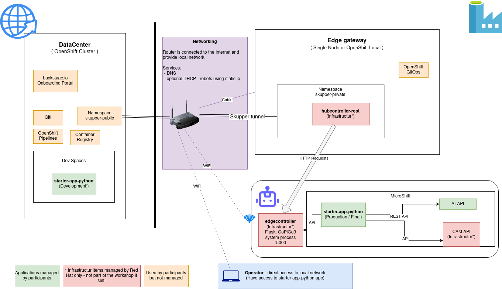

# Development 🪣




## Workshop flow

 * By default be build the entire end-to-end solution
 * Depend on the audience we remove parts like:
     * AI/ML Model Training
     * Application development (starter-app-python)
     * Maybe development in different languages because it just consume and ML/API, CAM IP and Robot API
     * Build GitOps infrastructure and rollout applications
     * Pipeline for all applications (Maybe pipeline as code )
     * …
 * The flow is:
     * Development Application in DataCenter - or just test / with Robot Access
     * Train model with new Objects
     * Close connection to robot
     * Depoy application on Robot
     * Let’s drive the Robot in a competition situation against other teams.


## Set Up

### Setting up OpenShift Local / OpenShift Single Node

During the demo we using OpenShift Local running on the presenter laptop

**Required:**
 * Running openshift local, follow the [officia documetation](https://developers.redhat.com/products/openshift-local/overview)


Install OpenShift GitOps & OpenShift Pipelines via:
```bash
oc apply -k openshift-local/
```

Added cluster to argocd instance

```bash
# Login into Robot
oc login -u kubeadmin ....

# Login into OpenShift GitOps at OpenShift Local instance
argocd login ...

# Add cluster to argocd instance
argocd cluster add $(oc config current-context )
```

Example outpur of `argocd cluster list`:
```bash
$ argocd cluster list
SERVER                          NAME         VERSION  STATUS   MESSAGE                                              PROJECT
https://10.89.114.152:6443      goetz-robot           Unknown  Cluster has no application and not being monitored.
https://kubernetes.default.svc  in-cluster            Unknown  Cluster has no application and not being monitored.
```

Apply ArgoCD Application:
```bash
oc apply -f openshift-local/starter-app.application.yaml
oc apply -f openshift-local/hubcontroller-rest.application.yaml
```
## hubcontroller-rest test commands

```bash
# Forward
curl -k -X POST  https://test-hubcontroller-rest.apps.edgesno.example.com/api/robot/forward/1?user_key=terminator

```

## Open Issues

- [ ] Containerize GoPiGo3
      https://github.com/cloud-native-robotz-hackathon/edgecontroller/issues/1
